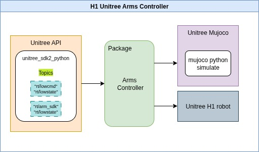

# H1 Arms Controller

This repository includes two modular Python packages for controlling the [Unitree H1 humanoid robot](https://www.unitree.com/products/h1/):

- `h1_control`: Low-level arm control for simulation and real robot via DDS topic `rt/lowcmd`
- `h1_high_control`: High-level torque control via topic `rt/arm_sdk` for direct control of the arms of H1 robot

Both packages support dual-arm motion, forward/inverse kinematics using Pinocchio, and structured logging/plotting tools. The project is ROS-free and tested in both Unitree Mujoco simulator and hardware.

---

## 🧩 System Overview



## 📚 Table of Contents

- [Features](#features)
- [Requirements](#requirements)
- [Dependencies Installationion](#dependencies-installation)
- [Project Structure](#project-structure)
- [Package Breakdown](#package-breakdown)
- [Run Example](#run-example)
- [Results](#results)

---
## Features

- Inverse & Forward Kinematics using [Pinocchio](https://stack-of-tasks.github.io/pinocchio/) and CasADi
- Low-level joint control via DDS messaging using [Unitree SDK2 Python](https://github.com/unitreerobotics/unitree_sdk2_python)
- Inspire hand control via DDS messaging (open/close commands)
- Supports **RPY**, **quaternion**, and **rotation vector** targeting formats
- Fully tested with the **Unitree Mujoco simulator** using [Unitree_mujoco](https://github.com/unitreerobotics/Unitree_mujoco)
- Work on both simulator and real-robot
- Clean modular architecture designed for **dual-arm manipulation tasks**
- Research-friendly, ROS-free standalone design

## Requirements

- Python ≥ 3.8
- NumPy 1.21.5 < 2.0 (required for Pinocchio compatibility)
- [Pinocchio](https://stack-of-tasks.github.io/pinocchio/download.html)
- CasADi 3.7.0
- SciPy 1.8.0
- unitree_sdk2py (official Unitree Python SDK)
- Unitree Mujoco Simulator (for simulation)
## Dependencies Installation
### 1. Install Unitree SDK2 Python

```bash
cd ~
sudo apt install python3-pip
git clone https://github.com/unitreerobotics/unitree_sdk2_python.git
cd unitree_sdk2_python
pip3 install -e .
``` 
### 2. Install Unitree Mujoco (Python-based simulation)

```bash
pip install mujoco
pip install pygame

cd ~
git clone https://github.com/unitreerobotics/unitree_mujoco.git
```
### 3.  Install CasADi, SciPy libraries
```bash
pip install casadi scipy
```
### 4. Install NumPy < 2.0 (required for Pinocchio)
```bash
pip install numpy==1.26.4
```
### 5. Install Pinocchio using robotpkg
Follow this official guide:

👉 https://stack-of-tasks.github.io/pinocchio/download.html

Then, set up your environment:
```bash
echo 'export PATH=/opt/openrobots/bin:$PATH' >> ~/.bashrc
echo 'export PKG_CONFIG_PATH=/opt/openrobots/lib/pkgconfig:$PKG_CONFIG_PATH' >> ~/.bashrc
echo 'export LD_LIBRARY_PATH=/opt/openrobots/lib:$LD_LIBRARY_PATH' >> ~/.bashrc
echo 'export PYTHONPATH=/opt/openrobots/lib/python3.10/site-packages:$PYTHONPATH' >> ~/.bashrc
echo 'export CMAKE_PREFIX_PATH=/opt/openrobots:$CMAKE_PREFIX_PATH' >> ~/.bashrc

source ~/.bashrc
```
### 6. Clone This Repository and Set Python Path 
```bash
cd ~
git clone https://github.com/Yara-NM/h1_arms_controller.git
cd h1/
pip install -e .
```
## 7. Set up the simulator with H1 
Edit the config file:
```bash
nano ~/unitree_mujoco/simulate_python/config.py
```
Change these lines:
```python
ROBOT = "h1"
USE_JOYSTICK = 0
ENABLE_ELASTIC_BAND = True
```
Run the simulator, Mujoco simulator should run with Unitree H1 robot:
```bash
cd ~/unitree_mujoco/simulate_python
python3 unitree_mujoco.py
```

🕹️ Controls in simulation:

9 — Enable/disable elastic band

7 / 8 — Lift/lower robot


## Project Structure

```text
.
├── arms_controller

│   ├── assets/h1
│   │   ├── meshes
│   │   └── h1.urdf

│   ├── h1_robot_controller.py
│   ├── h1_ik_solver.py
│   ├── joint_controller.py
│   ├── joint_controller_2layers.py
│   ├── unitree_legged_const.py
│   ├── plotting.py
│   └── utils.py   
├── demo
│   ├── results/ 
│   └── test.py

├── wristController.py
├── inspireHandController.py
```

---

## Package Breakdown

Each control package (low/high) contains:

- `h1_robot_controller.py`: Unified interface to IK, joint control, logging, plotting
- `joint_controller.py`: Main control logic (low-level or torque-based)
- - `joint_controller_2layers.py`: there another interpolation layer to control the trajectory in joint-space 
- `ik_solver.py`: CasADi-based inverse kinematics using Pinocchio
- `plotting.py`: Saves joint position/velocity/torque as SVG with timestamps
- `utils.py`: Math tools (quat, RPY, rotvec), joint name remapping
- `unitree_legged_const.py`: Constants for safe stopping and joint parameters

---

## Run Example

### ▶️  Simulation or Real Robot
```bash
cd h1/demo
python3 test.py
```

⚠️ Edit the DDS communication interface in the test file if needed:
```python
ChannelFactoryInitialize(0, "enp2s0")
```
Replace `"enp2s0"` with your actual interface (`ifconfig` to check).

---


 
